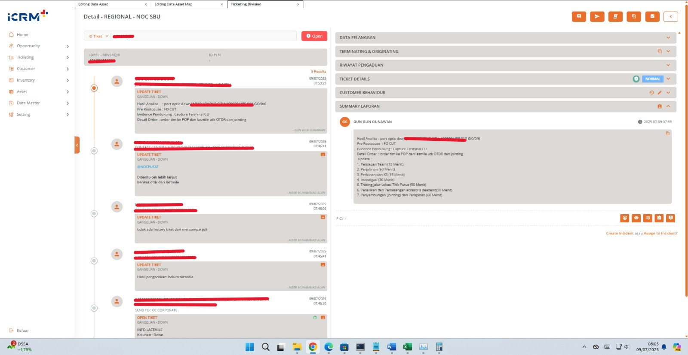
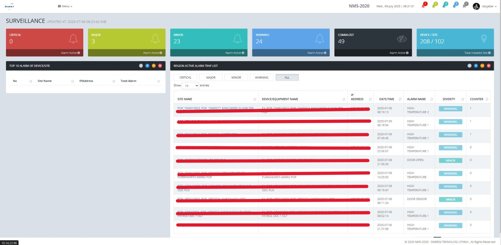
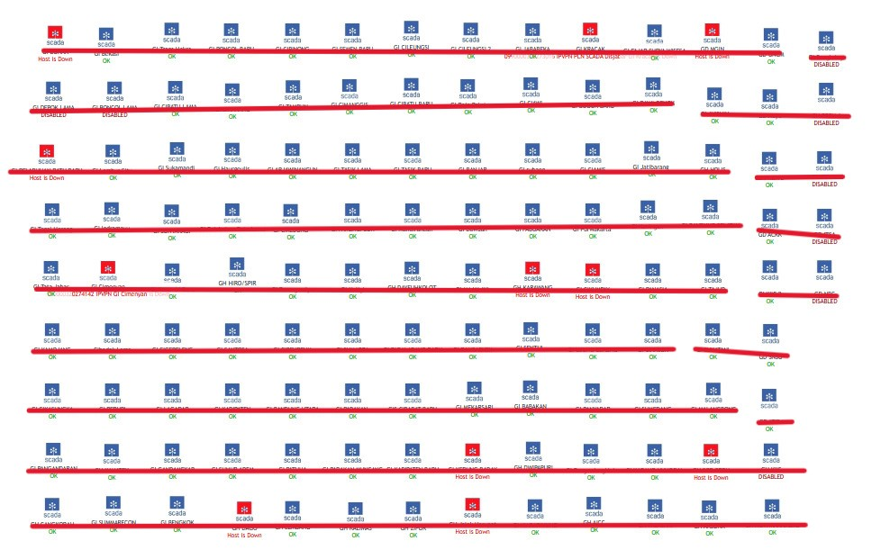
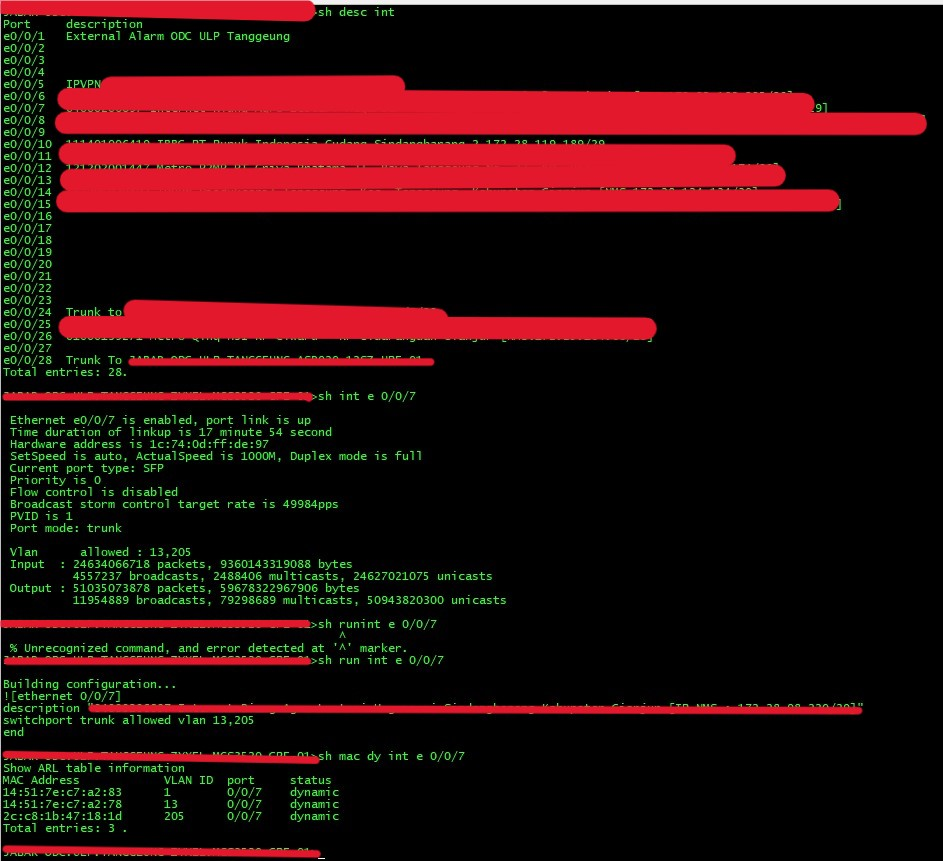
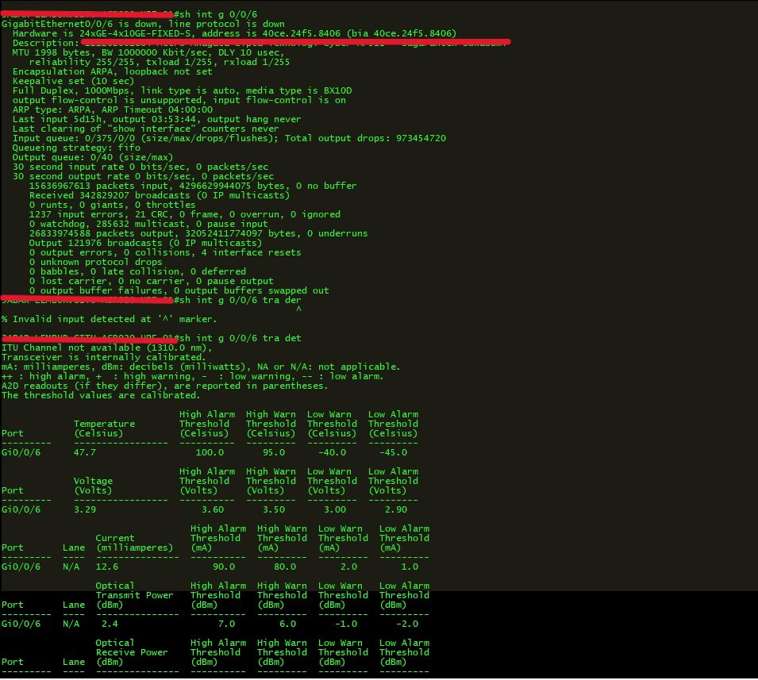
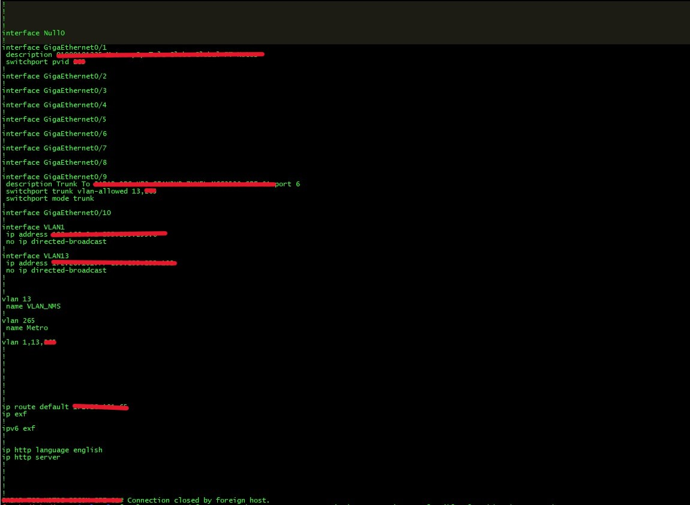
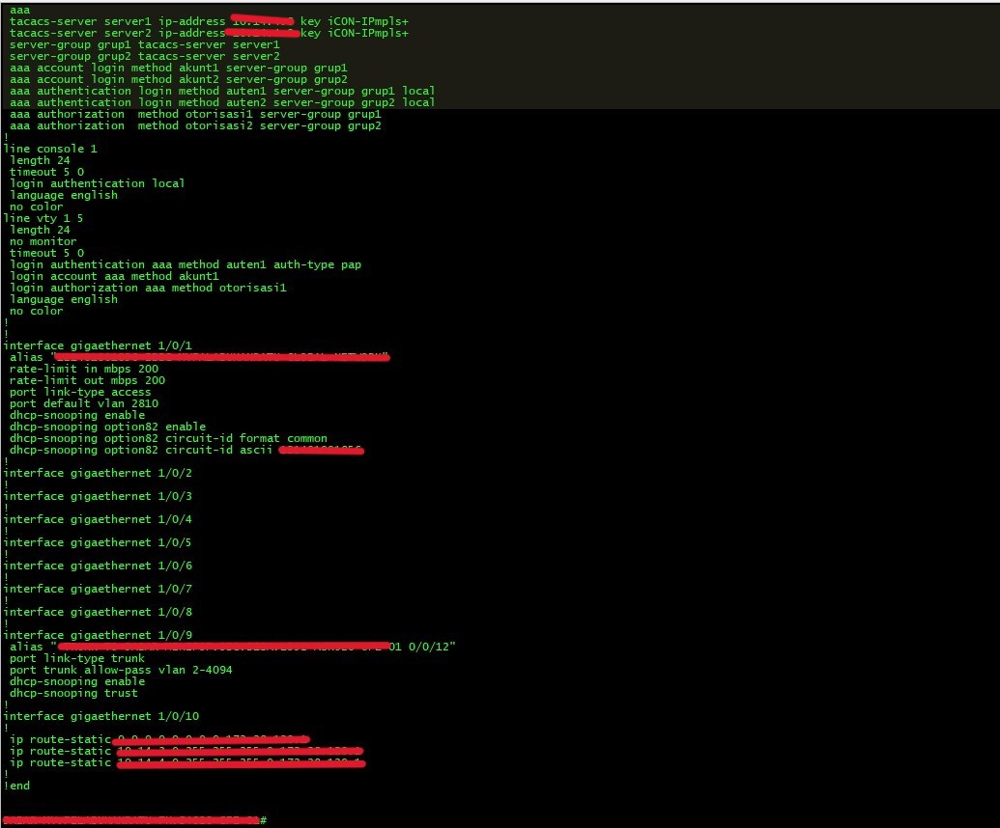

# Portofolio - Helpdesk NOC Specialist | Tiar Firman Syah 

Halo! Selamat datang di portofolio saya yang mendokumentasikan pengalaman dan keterampilan saya sebagai **Helpdesk NOC (Network Operations Center) Specialist** di **PT PLN ICON+ SBU Jabar**.

Saya adalah seorang profesional yang berdedikasi dalam menjaga ketersediaan dan kinerja layanan jaringan telekomunikasi. Dengan pengalaman saya di lingkungan NOC, saya berfokus pada respons cepat terhadap insiden, *troubleshooting* awal, eskalasi yang efektif, dan komunikasi yang transparan untuk memastikan operasional yang lancar. Saya memiliki kemampuan untuk bekerja secara mandiri maupun dalam tim , serta mengimplementasikan konsep dan teori teknis informatika untuk menyelesaikan permasalahan

## Tentang Pekerjaan Saya di PT PLN ICON+ SBU Jabar

Sebagai Helpdesk NOC di PT PLN ICON+ SBU Jabar, peran utama saya adalah menjadi titik kontak pertama bagi pelanggan atau pengguna internal terkait masalah jaringan dan layanan. Saya bertanggung jawab untuk melakukan pemantauan proaktif, *troubleshooting* Level 1, dan eskalasi insiden untuk memastikan layanan telekomunikasi dan jaringan berjalan optimal dalam lingkungan operasional 24/7.

### Tanggung Jawab Utama (Job Description):

1.  **Penerimaan & Pencatatan Insiden:**
    * Menerima laporan gangguan, keluhan, atau pertanyaan dari pelanggan/pengguna internal.
    * Merekam detail insiden secara akurat dan lengkap ke dalam sistem *ticketing* utama (**ICRM+**)
    * Memberikan nomor tiket kepada pelapor untuk tujuan pelacakan.

2.  **Pemantauan & Analisis Awal Jaringan:**
    * Melakukan pemantauan *real-time* status jaringan dan perangkat telekomunikasi menggunakan *tools* seperti **Zabbix, NMS Hariff, NMS Sinergi, dan Monitoring Scada**.
    * Mengidentifikasi anomali dan *alert* dari sistem pemantauan.
    * Melakukan analisa dan *troubleshooting* awal permasalahan jaringan secara mandiri

3.  **Troubleshooting Level 1:**
    * Melakukan investigasi dan *troubleshooting* awal terhadap insiden yang dilaporkan.
    * Melakukan identifikasi, validasi, dan langkah-langkah *troubleshooting* awal sesuai **SOP Troubleshooting dan Eskalasi**
    * Melakukan **konfigurasi perangkat jaringan sederhana (BDCOM, Fiberhome)** sesuai instruksi dan SOP.

4.  **Eskalasi & Koordinasi Insiden:**
    * Mengevaluasi tingkat urgensi dan dampak insiden.
    * Melakukan eskalasi insiden yang tidak dapat diselesaikan pada level 1 kepada tim teknis NOC atau tim terkait lainnya sesuai prosedur operasional standar (SOP).
    * **Berkoordinasi dengan tim NOC** dalam menyelesaikan masalah.
    * Memastikan informasi yang diperlukan untuk eskalasi disampaikan dengan jelas dan lengkap.

5.  **Komunikasi & Dokumentasi:**
    * **Berkomunikasi secara efektif baik lisan maupun tulisan** dengan tim internal NOC dan tim terkait lainnya.
    * Memberikan pembaruan status secara berkala kepada pelapor (pelanggan/pengguna internal) mengenai progres penanganan insiden.
    * Mendokumentasikan **laporan/log sistem tiket (ICRM+)** dan log komunikasi di *platform* kerja (**WhatsApp, ICRM+**).
    * Membuat **laporan penyelesaian tiket gangguan secara mandiri**.
    * Membuat **Laporan tiket harian**.
    * Membuat laporan dan melakukan evaluasi terkait penanganan insiden.

## Keterampilan Teknis

* **Sistem Monitoring:** Zabbix, NMS Hariff, NMS Sinergi, Monitoring Scada.
* **Sistem Ticketing:** ICRM+.
* **Konsep Jaringan:** OSI Layer, TCP/IP, dasar-dasar *routing* dan *switching*.
* **Perangkat Jaringan:** BDCOM, Fiberhome, Zyxel, Cisco ASR920.
* **Troubleshooting:** Identifikasi masalah, validasi, eskalasi insiden.
* **Dokumentasi:** Pembuatan laporan insiden.
* **CLI:** Penggunaan CMD dalam administrasi jaringan.

## Keterampilan Non-Teknis (Soft Skills)

* **Komunikasi Efektif:** Mampu berkomunikasi baik secara lisan maupun tertulis, mampu bekerjasama dalam tim.
* **Pemecahan Masalah:** Mampu menganalisis dan menyelesaikan masalah secara mandiri atau melalui eskalasi.
* **Kerja Mandiri dan Tim:** Mampu bekerja secara mandiri dan dalam tim.
* **Koordinasi:** Baik dengan tim internal NOC maupun tim teknis lapangan.
* **Manajemen Tugas:** Pembagian tugas dalam *shift* kerja untuk operasional 24/7.
* **Orientasi Layanan:** Berfokus pada kepuasan pelanggan dan ketersediaan layanan.

## Proyek & Bukti Pekerjaan

Berikut adalah visualisasi dari *tools* dan proses yang saya tangani sehari-hari sebagai Helpdesk NOC.

### 1. Sistem Ticketing ICRM+

Saya bertanggung jawab penuh dalam siklus penanganan tiket, mulai dari penerimaan laporan Tiket, pencatatan detail, hingga pelaporan penyelesaian menggunakan **ICRM+**.

* **Alur Tiket Gangguan dari Penerimaan hingga Eskalasi/Penyelesaian:**
    * **Tampilan ICRM+ (Dashboard Overview):**
        
        *Gambaran: Dashboard ICRM+ untuk pemantauan tiket.*
    * **Tiket *Open* (Detail Tiket Baru):**
        
        *Gambar: Detail tiket yang baru dibuka dan siap untuk dianalisis.*
    * **Proses Analisa Gangguan:**
        
        *Gambar: Langkah-langkah analisa awal yang saya lakukan pada tiket gangguan.*
    * **Proses Eskalasi Tiket kepada Tim Lapangan:**
        
        *Gambar: Proses eskalasi tiket ke tim lapangan setelah *troubleshooting* Level 1.*
    * **Proses *Closed* Tiket setelah Pengecekan Uplink/Downlink:**
        
        *Gambar: Tiket Close setelah verifikasi penyelesaian masalah.*

### 2. Laporan Bulanan Tiket Gangguan 

Membuat laporan gangguan tiket bulanan yang di rekap per hari.

*Gambar: laporan bulanan tiket gangguan yang direkap per hari.*

### 3. Sistem Monitoring Jaringan 

Pemantauan *real-time* adalah inti dari operasional NOC. Saya menggunakan berbagai *tools monitoring* untuk memastikan stabilitas jaringan.

* **Monitoring Surveillance NMS Hariff Jabar:**
    
    *Gambar: Tampilan sistem monitoring Surveillance NMS Hariff Jabar untuk overview status jaringan.*
* **Monitoring Surveillance NMS Sinergi Jabar:**
    
    *Gambar: Tampilan sistem monitoring Surveillance NMS Sinergi Jabar untuk overview status jaringan.*
* **Monitoring Scada Premium:**
    
    *Gambar: Dashboard monitoring Scada Premium untuk pemantauan yang lebih mendalam.*
* **Monitoring Scada:**
    
    *Gambar: Tampilan standar sistem monitoring Scada.*
* **Monitoring GSM Scada:**
    
    *Gambar: Contoh tampilan monitoring GSM Scada.*

### 4. Perangkat Jaringan yang Ditangani

Saya memiliki pengalaman dalam melakukan pengecekan dan konfigurasi dasar pada berbagai perangkat jaringan.

* **Pengecekan Uplink/Downlink di Perangkat Zyxel:**
    
    *Gambar: Proses pengecekan status *uplink/downlink* pada perangkat Zyxel.*
* **Pengecekan Uplink/Downlink di Perangkat ASR920:**
    
    *Gambar: Pengecekan *uplink/downlink* pada perangkat Cisco ASR920.*
* **Konfigurasi Perangkat BDCOM:**
     
    *Gambar: Konfigurasi dasar pada perangkat BDCOM.*
* **Konfigurasi Perangkat Fiberhome:**
    
    *Gambar: Konfigurasi dasar pada perangkat Fiberhome.*

## Kontak Saya

Terima kasih telah mengunjungi portofolio saya! Jika Anda tertarik untuk berdiskusi lebih lanjut mengenai pengalaman dan keterampilan saya, jangan ragu untuk menghubungi saya:

* **Nama:** Tiar Firman Syah
* **LinkedIn:** [https://www.linkedin.com/in/tiar-firman-syah-4b2706297/](https://www.linkedin.com/in/tiar-firman-syah-4b2706297/)
* **Email:** [tiarfirmansss@gmail.com](mailto:tiarfirmansss@gmail.com)