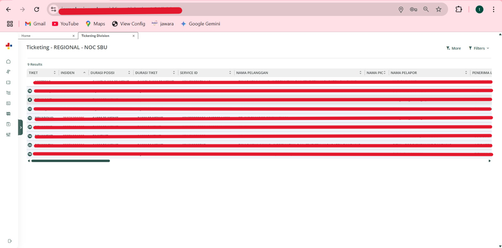
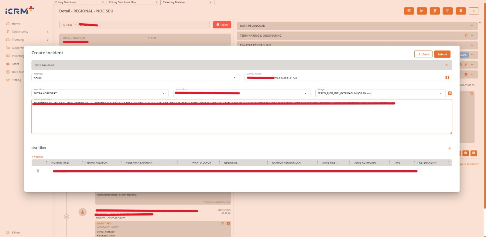
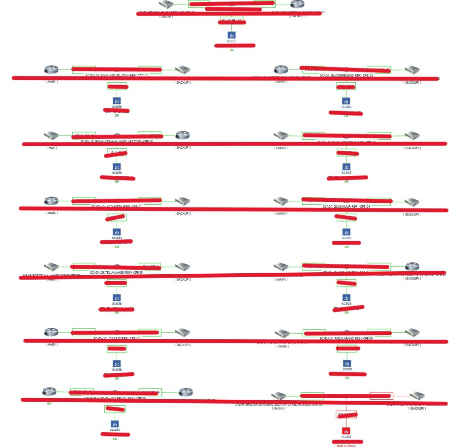

# Portofolio - Helpdesk NOC Specialist

Halo! Selamat datang di portofolio saya yang mendokumentasikan pengalaman dan keterampilan saya sebagai **Helpdesk NOC (Network Operations Center) Specialist** di **PT PLN ICON+ SBU Jabar**.

Saya adalah seorang profesional yang berdedikasi dalam menjaga ketersediaan dan kinerja layanan jaringan telekomunikasi. Dengan pengalaman saya di lingkungan NOC, saya berfokus pada respons cepat terhadap insiden, *troubleshooting* awal, eskalasi yang efektif, dan komunikasi yang transparan untuk memastikan operasional yang lancar.

## Tentang Pekerjaan Saya di PT PLN ICON+ SBU Jabar

Sebagai Helpdesk NOC, peran utama saya adalah menjadi titik kontak pertama untuk permasalahan jaringan dan layanan, melakukan pemantauan proaktif, dan memastikan resolusi insiden yang efisien. Saya bekerja dalam lingkungan operasional 24/7, memastikan layanan pelanggan dan infrastruktur jaringan selalu terpantau dan berfungsi optimal.

### Tanggung Jawab Utama (Job Description):

1.  **Penerimaan dan Pencatatan Insiden:**
    * Menerima laporan gangguan, keluhan, atau pertanyaan dari pelanggan/pengguna internal. 
    * Merekam detail insiden secara akurat dan lengkap ke dalam sistem *ticketing* (ICRM+). 
    * Memberikan nomor tiket kepada pelapor untuk tujuan pelacakan.

2.  **Pemantauan dan Analisis Awal Jaringan:**
    * Melakukan pemantauan *real-time* status jaringan dan perangkat telekomunikasi menggunakan *tools* seperti Zabbix, NMS Hariff, NMS Sinergi, dan Monitoring Scada.
    * Mengidentifikasi anomali dan *alert* dari sistem pemantauan.
    * Melakukan analisa dan *troubleshooting* awal permasalahan jaringan secara mandiri.
3.  **Troubleshooting Level 1:**
    * Melakukan investigasi dan *troubleshooting* awal terhadap insiden yang dilaporkan
    * Melakukan identifikasi, validasi, dan langkah-langkah *troubleshooting* awal sesuai SOP.
    * Melakukan konfigurasi perangkat jaringan sederhana sesuai instruksi dan SOP. 
4.  **Eskalasi dan Koordinasi Insiden:**
    * Mengevaluasi tingkat urgensi dan dampak insiden.
    * Melakukan eskalasi insiden yang tidak dapat diselesaikan pada level 1 kepada tim teknis NOC atau tim terkait lainnya sesuai prosedur operasional standar (SOP).
    * Berkoordinasi aktif dengan tim NOC dalam menyelesaikan masalah.
    * Memastikan informasi yang diperlukan untuk eskalasi disampaikan dengan jelas dan lengkap.

5.  **Komunikasi dan Dokumentasi:**
    * Berkomunikasi secara efektif baik lisan maupun tulisan dengan tim internal NOC dan tim terkait lainnya. 
    * Memberikan pembaruan status secara berkala kepada pelapor (pelanggan/pengguna internal) mengenai progres penanganan insiden.
    * Mendokumentasikan laporan/log sistem tiket (ICRM+)dan log komunikasi di platform kerja (WhatsApp, ICRM+).  	
    * Membuat laporan penyelesaian tiket gangguan secara mandiri. 
    * Membuat laporan harian tiket. 
    * Membuat laporan dan melakukan evaluasi terkait penanganan insiden. 
    * Mencatat log aktivitas sistem yang menunjukkan kontribusi individu dalam menangani isu.

## Keterampilan Teknis

* **Sistem Monitoring:** Zabbix, NMS Hariff, NMS Sinergi, Monitoring Scada.
* **Sistem Tiketing:** ICRM+
* **Konsep Jaringan:** OSI Layer, TCP/IP, dasar-dasar *routing* dan *switching*.
* **Perangkat Jaringan:** BDCOM, Fiberhome, Zyxel, Cisco ASR920.
* **Troubleshooting:** Identifikasi masalah, validasi, eskalasi insiden.
* **Dokumentasi:** Pembuatan laporan insiden, log aktivitas.

## Keterampilan Non-Teknis (Soft Skills)

* **Komunikasi Efektif:** Lisan dan tulisan, termasuk koordinasi tim internal dan eksternal.
* **Pemecahan Masalah:** Mampu menganalisis dan menyelesaikan masalah secara mandiri atau melalui eskalasi.
* **Kerja Tim:** Kolaborasi dalam *shift* kerja dan koordinasi lintas departemen.
* **Manajemen Waktu:** Prioritas insiden dan penanganan multi-tasking.
* **Orientasi Layanan:** Berfokus pada kepuasan pelanggan dan ketersediaan layanan.

## Proyek / Bukti Pekerjaan

* **Sistem Ticketing ICRM+:**
    * Alur tiket gangguan dari penerimaan hingga eskalasi/penyelesaian
    * 
    * Tiket Open
    * 
    * Proses Analisa Gangguan
    * 
    * Proses Eskalasi Tiket kepada Tim Lapangan
    * 
    * Proses Closed Tiket setelah pengecekan Uplink / Downlink 
    * 
* **Laporan Bulanan Tiket Gangguan:**
    * Laporan Gangguan Tiket Bulanan yang di rekap per hari
    * 
* **Sistem Monitoring:**
    * Monitoring Surveilence NMS Jabar
    * 
    * Monitoring Scada Premium
    * 
    * Monitoring Scada
    * 
    * Monitoring GSM Scada
    * 

* **Perangkat Jaringan:**
    * Pengecekan Uplink / Downlink di Perangkat Zyxel
    * 
    * Pengexekan Uplink / Downlink di Perangkat ASR920
    * 
    * Configurasi Perangkat BDCOM
    * 
    * Configurasi Perangkat Fiberhome
    * 

## Kontak

Jika Anda tertarik untuk berdiskusi lebih lanjut mengenai pengalaman saya, jangan ragu untuk menghubungi saya:

* **LinkedIn:** [https://www.linkedin.com/in/tiar-firman-syah-4b2706297/]
* **Email:** [tiarfirmansss@gmail.com]

