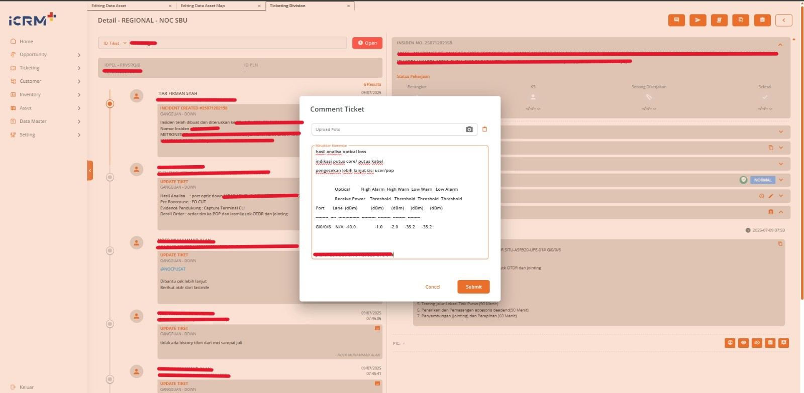
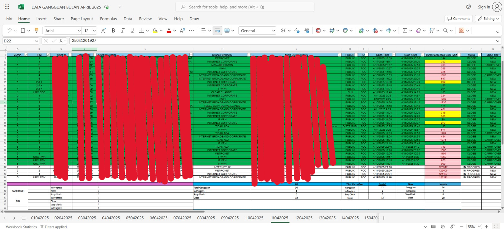
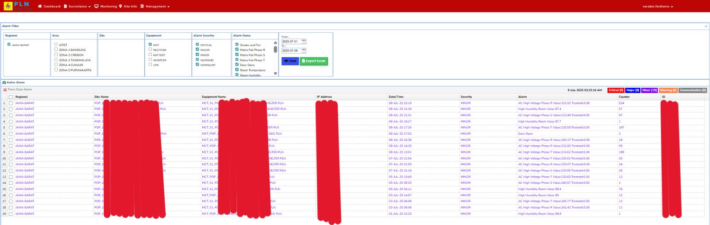
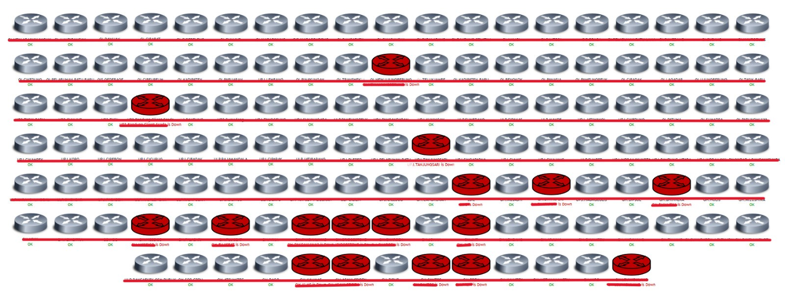

# 🌟 Portofolio - Helpdesk NOC Specialist | Tiar Firman Syah 🌟

Halo! Selamat datang di portofolio saya yang mendokumentasikan pengalaman dan keterampilan saya sebagai **Helpdesk NOC (Network Operations Center) Specialist** di **PT PLN ICON+ SBU Jabar**.

Saya adalah seorang profesional yang berdedikasi dalam menjaga ketersediaan dan kinerja layanan jaringan telekomunikasi. Dengan pengalaman saya di lingkungan NOC, saya berfokus pada respons cepat terhadap insiden, *troubleshooting* awal, eskalasi yang efektif, dan komunikasi yang transparan untuk memastikan operasional yang lancar. [cite_start]Saya memiliki kemampuan untuk bekerja secara mandiri maupun dalam tim [cite: 13][cite_start], serta mengimplementasikan konsep dan teori teknis informatika untuk menyelesaikan permasalahan[cite: 16].

## 💡 Tentang Pekerjaan Saya di PT PLN ICON+ SBU Jabar

Sebagai Helpdesk NOC di PT PLN ICON+ SBU Jabar, peran utama saya adalah menjadi titik kontak pertama bagi pelanggan atau pengguna internal terkait masalah jaringan dan layanan. Saya bertanggung jawab untuk melakukan pemantauan proaktif, *troubleshooting* Level 1, dan eskalasi insiden untuk memastikan layanan telekomunikasi dan jaringan berjalan optimal dalam lingkungan operasional 24/7.

### 🎯 Tanggung Jawab Utama (Job Description):

1.  **Penerimaan & Pencatatan Insiden:**
    * Menerima laporan gangguan, keluhan, atau pertanyaan dari pelanggan/pengguna internal.
    * [cite_start]Merekam detail insiden secara akurat dan lengkap ke dalam sistem *ticketing* utama (**ICRM+**)[cite: 16].
    * Memberikan nomor tiket kepada pelapor untuk tujuan pelacakan.

2.  **Pemantauan & Analisis Awal Jaringan:**
    * [cite_start]Melakukan pemantauan *real-time* status jaringan dan perangkat telekomunikasi menggunakan *tools* seperti **Zabbix, NMS Hariff, NMS Sinergi, dan Monitoring Scada**[cite: 22].
    * Mengidentifikasi anomali dan *alert* dari sistem pemantauan.
    * [cite_start]Melakukan analisa dan *troubleshooting* awal permasalahan jaringan secara mandiri[cite: 13].

3.  **Troubleshooting Level 1:**
    * Melakukan investigasi dan *troubleshooting* awal terhadap insiden yang dilaporkan.
    * [cite_start]Memiliki kemampuan mengimplementasikan pengetahuan yang dimiliki di tempat pelaksanaan kerja praktik[cite: 22].
    * [cite_start]Melakukan identifikasi, validasi, dan langkah-langkah *troubleshooting* awal sesuai **SOP Troubleshooting dan Eskalasi**[cite: 22].
    * [cite_start]Melakukan **konfigurasi perangkat jaringan sederhana (BDCOM, Fiberhome)** sesuai instruksi dan SOP[cite: 22].
    * [cite_start]Menggunakan **CMD** dalam administrasi jaringan (misalnya, *bypass* jaringan *user*)[cite: 22].

4.  **Eskalasi & Koordinasi Insiden:**
    * Mengevaluasi tingkat urgensi dan dampak insiden.
    * [cite_start]Melakukan eskalasi insiden yang tidak dapat diselesaikan pada level 1 kepada tim teknis NOC atau tim terkait lainnya sesuai prosedur operasional standar (SOP)[cite: 16].
    * [cite_start]**Berkoordinasi dengan tim NOC** dalam menyelesaikan masalah[cite: 16].
    * Memastikan informasi yang diperlukan untuk eskalasi disampaikan dengan jelas dan lengkap.

5.  **Komunikasi & Dokumentasi:**
    * [cite_start]**Berkomunikasi secara efektif baik lisan maupun tulisan** dengan tim internal NOC dan tim terkait lainnya[cite: 16].
    * Memberikan pembaruan status secara berkala kepada pelapor (pelanggan/pengguna internal) mengenai progres penanganan insiden.
    * [cite_start]Mendokumentasikan **laporan/log sistem tiket (ICRM+)** dan log komunikasi di *platform* kerja (**WhatsApp, ICRM+**)[cite: 16].
    * [cite_start]Membuat **laporan penyelesaian tiket gangguan secara mandiri**[cite: 13].
    * [cite_start]Membuat **tiket harian**[cite: 16].
    * [cite_start]Membuat laporan dan melakukan evaluasi terkait penanganan insiden[cite: 22].
    * [cite_start]Mencatat **log aktivitas sistem yang menunjukkan kontribusi individu** dalam menangani isu[cite: 13].

## 🛠️ Keterampilan Teknis

* [cite_start]**Sistem Monitoring:** Zabbix, NMS Hariff, NMS Sinergi, Monitoring Scada[cite: 22].
* [cite_start]**Sistem Ticketing:** ICRM+[cite: 16].
* [cite_start]**Konsep Jaringan:** OSI Layer, TCP/IP, dasar-dasar *routing* dan *switching*[cite: 22].
* [cite_start]**Perangkat Jaringan:** BDCOM, Fiberhome[cite: 22], Zyxel, Cisco ASR920.
* [cite_start]**Troubleshooting:** Identifikasi masalah, validasi, eskalasi insiden[cite: 22].
* [cite_start]**Dokumentasi:** Pembuatan laporan insiden, log aktivitas[cite: 22].
* [cite_start]**CLI:** Penggunaan CMD dalam administrasi jaringan[cite: 22].

## 🤝 Keterampilan Non-Teknis (Soft Skills)

* [cite_start]**Komunikasi Efektif:** Mampu berkomunikasi baik secara lisan maupun tertulis, mampu bekerjasama dalam tim[cite: 16].
* **Pemecahan Masalah:** Mampu menganalisis dan menyelesaikan masalah secara mandiri atau melalui eskalasi.
* [cite_start]**Kerja Mandiri dan Tim:** Mampu bekerja secara mandiri dan dalam tim[cite: 13].
* [cite_start]**Koordinasi:** Baik dengan tim internal NOC maupun tim teknis lapangan[cite: 16].
* [cite_start]**Manajemen Tugas:** Pembagian tugas dalam *shift* kerja untuk operasional 24/7[cite: 16].
* **Orientasi Layanan:** Berfokus pada kepuasan pelanggan dan ketersediaan layanan.

## 🚀 Proyek & Bukti Pekerjaan

Berikut adalah visualisasi dari *tools* dan proses yang saya tangani sehari-hari sebagai Helpdesk NOC. *(Catatan: Semua gambar telah dianonimkan atau disimulasikan untuk menjaga kerahasiaan data perusahaan.)*

### 1. Sistem Ticketing ICRM+ 🎫

[cite_start]Saya bertanggung jawab penuh dalam siklus penanganan tiket, mulai dari penerimaan laporan, pencatatan detail, hingga pelaporan penyelesaian menggunakan **ICRM+**[cite: 16].

* **Alur Tiket Gangguan dari Penerimaan hingga Eskalasi/Penyelesaian:**
    * **Tampilan ICRM+ (Dashboard Overview):**
        
        *Gambaran umum dashboard ICRM+ untuk pemantauan tiket.*
    * **Tiket *Open* (Detail Tiket Baru):**
        
        *Detail tiket yang baru dibuka dan siap untuk dianalisis.*
    * **Proses Analisa Gangguan:**
        
        *Langkah-langkah analisa awal yang saya lakukan pada tiket gangguan.*
    * **Proses Eskalasi Tiket kepada Tim Lapangan:**
        
        *Contoh proses eskalasi tiket ke tim lapangan setelah *troubleshooting* Level 1.*
    * **Proses *Closed* Tiket setelah Pengecekan Uplink/Downlink:**
        
        *Tiket ditutup setelah verifikasi penyelesaian masalah.*

### 2. Laporan Bulanan Tiket Gangguan 📈

Saya secara rutin merekap dan membuat laporan gangguan tiket bulanan per hari, memberikan *insight* tentang tren dan kinerja.

*Gambar: Contoh format laporan bulanan tiket gangguan yang direkap per hari.*

### 3. Sistem Monitoring Jaringan 👁️‍🗨️

Pemantauan *real-time* adalah inti dari operasional NOC. [cite_start]Saya menggunakan berbagai *tools monitoring* untuk memastikan stabilitas jaringan[cite: 22].

* **Monitoring Surveillance NMS Jabar:**
    
    *Gambar: Tampilan sistem monitoring Surveillance NMS Jabar untuk overview status jaringan.*
* **Monitoring Scada Premium:**
    
    *Gambar: Dashboard monitoring Scada Premium untuk pemantauan yang lebih mendalam.*
* **Monitoring Scada:**
    
    *Gambar: Tampilan standar sistem monitoring Scada.*
* **Monitoring GSM Scada:**
    
    *Gambar: Contoh tampilan monitoring GSM Scada.*

### 4. Perangkat Jaringan yang Ditangani 🔌

[cite_start]Saya memiliki pengalaman dalam melakukan pengecekan dan konfigurasi dasar pada berbagai perangkat jaringan[cite: 22].

* **Pengecekan Uplink/Downlink di Perangkat Zyxel:**
    
    *Gambar: Proses pengecekan status *uplink/downlink* pada perangkat Zyxel.*
* **Pengecekan Uplink/Downlink di Perangkat ASR920:**
    
    *Gambar: Pengecekan *uplink/downlink* pada perangkat Cisco ASR920.*
* **Konfigurasi Perangkat BDCOM:**
    
    *Gambar: Proses konfigurasi dasar pada perangkat BDCOM.*
* **Konfigurasi Perangkat Fiberhome:**
    
    *Gambar: Proses konfigurasi dasar pada perangkat Fiberhome.*

## 📞 Kontak Saya

Terima kasih telah mengunjungi portofolio saya! Jika Anda tertarik untuk berdiskusi lebih lanjut mengenai pengalaman dan keterampilan saya, jangan ragu untuk menghubungi saya:

* [cite_start]**Nama:** Tiar Firman Syah [cite: 5, 29]
* **LinkedIn:** [https://www.linkedin.com/in/tiar-firman-syah-4b2706297/](https://www.linkedin.com/in/tiar-firman-syah-4b2706297/)
* **Email:** tiarfirmansss@gmail.com